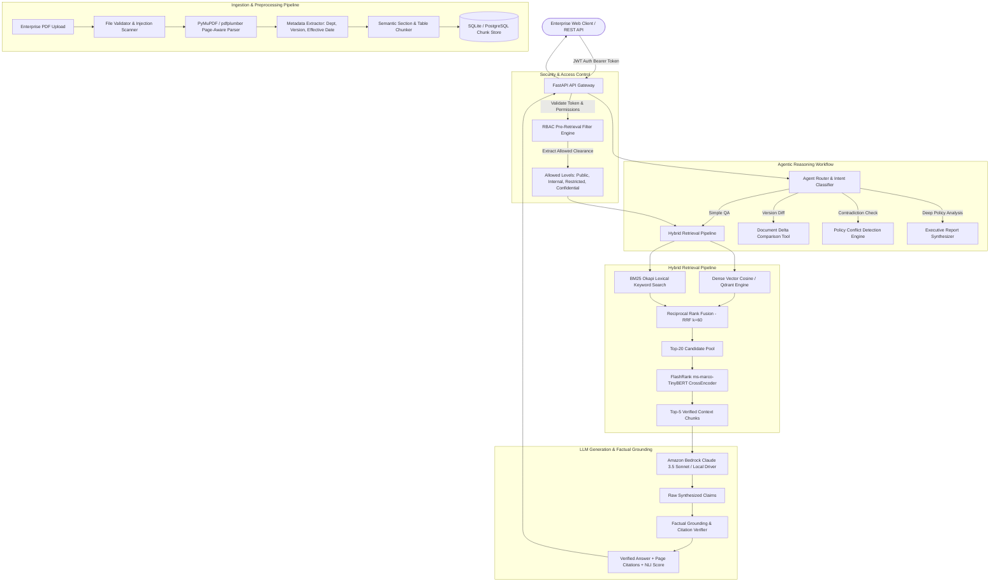

# NEXUS — Enterprise Agentic Document Intelligence Platform
## Complete Architecture & Engineering Technical Specification

---

## 1. Executive Summary & Problem Space

Enterprise knowledge systems routinely fail when deployed directly with generic Retrieval-Augmented Generation (RAG) pipelines. Typical enterprise failures include:
1. **Unbounded character chunking** that severs table rows, breaks policy clauses across arbitrary boundaries, and discards page numbering.
2. **Missing Pre-Retrieval Authorization (RBAC)**, leaking restricted HR salaries or confidential cybersecurity SOPs to unauthorized employees via vector semantic similarity.
3. **Keyword-Dense Query Misses**, where dense vector embeddings fail to match exact policy IDs (`POL-FIN-2025-v2`), monetary amounts (`₹5,000`), or section numbers (`Section 4.1`).
4. **Hallucination and Ungrounded Claims**, where LLMs synthesize plausible-sounding policy limits unsupported by company documents.
5. **Inability to Reason Across Document Versions**, missing conflicting clauses across departmental revisions (e.g., HR allowing 3 remote days while Cybersecurity limits remote access to 2 days).

**NEXUS** resolves every one of these enterprise challenges through a multi-tier, modular architecture operating in either 100% offline local development mode or enterprise AWS Bedrock/S3 cloud deployment.

---

## 2. High-Level System Architecture Diagram

---

## 3. Subsystem Breakdown

### 3.1 Document Ingestion & Table-Preserving Chunking
* **Input Validation**: Rejects files exceeding 25 MB, enforces `.pdf` MIME validation, computes SHA-256 hashes to prevent redundant reprocessing, and performs regex-based scanning for prompt injection attempts (`ignore previous instructions`, `you are now DAN`).
* **Page-Aware PDF Parsing**: Utilizes `PyMuPDF` (`fitz`) and `pdfplumber` to extract content page-by-page. Embedded tables are extracted into structured Markdown table representations (`| Col 1 | Col 2 |`) so semantic relationships across rows and columns remain intact.
* **Semantic Chunker**: Splits text into section-aware chunks (~350 tokens) with a 40-token sliding window overlap. Preserves section titles (`Section 2. DOMESTIC ACCOMMODATION`), ensures tables are treated as atomic units, and binds rich metadata (`page_number`, `document_id`, `version`, `access_level`) to every chunk.

### 3.2 Pre-Retrieval Role-Based Access Control (RBAC)
Unlike post-retrieval filtering (which wastes LLM context and risks leakage), NEXUS applies strict SQL/vector payload pre-filters:
* **Role Hierarchy**:
  * `Admin`: Clearance for `Public`, `Internal`, `Restricted`, `Confidential`.
  * `Security`: Clearance for `Public`, `Internal`, `Restricted (Cybersecurity)`, `Confidential`.
  * `HR`: Clearance for `Public`, `Internal`, `Restricted (People/HR)`.
  * `Finance`: Clearance for `Public`, `Internal`, `Restricted (Finance)`.
  * `Employee`: Clearance for `Public`, `Internal`.
* **Zero Leakage**: If an unauthorized user queries a confidential topic, the retriever returns an empty set or strictly unclassified chunks. The LLM never sees confidential context.

### 3.3 Hybrid Retrieval & Neural CrossEncoder Reranking
NEXUS blends semantic understanding with exact lexical matching using Reciprocal Rank Fusion ($RRF$):
1. **Dense Vector Retrieval**: Generates 384-dimensional dense embeddings (`sentence-transformers/all-MiniLM-L6-v2` or `amazon.titan-embed-text-v2`) and computes cosine similarity against indexed chunks.
2. **BM25 Okapi Keyword Retrieval**: Tokenizes queries and chunks to calculate frequency-inverse document frequency weights, excelling at exact policy IDs, dollar figures, and section numbers.
3. **Reciprocal Rank Fusion**:
   $$RRF\_Score(d \in D) = \sum_{m \in \{\text{dense}, \text{bm25}\}} \frac{1}{k + r_m(d)}$$
   where $k = 60$. Combines ranks into a unified candidate pool of 20 items.
4. **FlashRank Neural Cross-Encoder**: Evaluates query-passage pairs simultaneously using the ONNX-optimized `ms-marco-TinyBERT-L-2-v2` cross-attention model, outputting true relevance logits to select the Top-5 chunks.

### 3.4 Agent Workflows & Grounding Verification
1. **Agent Router**: Analyzes user intent using zero-shot classification:
   * `simple_qa`: Single or multi-document factual lookup.
   * `compare_docs`: Automated delta analysis across document versions.
   * `detect_conflict`: Contradiction analysis between disparate department policies.
   * `executive_report`: Comprehensive multi-document synthesis.
2. **Grounding & Verification Node**:
   * Deconstructs LLM responses into individual factual propositions.
   * Cross-verifies claims against retrieved source chunk tokens.
   * Computes a **Grounding Score** ($0.0 \le S \le 1.0$) reflecting empirical factual support.
   * Formats source citations explicitly as `[Filename — Page X, Section Y]`.

---

## 4. Cloud Architecture: AWS Bedrock & Production Scaling

When toggled from `LOCAL` to `PRODUCTION` mode (`AWS_BEDROCK_ENABLED=True`), NEXUS activates native AWS cloud integrations:
* **Amazon Bedrock**:
  * High-reasoning tasks: `anthropic.claude-3-5-sonnet-20241022-v2:0`
  * Embeddings: `amazon.titan-embed-text-v2:0`
* **Amazon S3**: Scalable object storage for enterprise PDFs (`s3://nexus-enterprise-documents/`).
* **Amazon ECS Fargate**: Containerized FastAPI backend with horizontal autoscaling based on CPU/Memory targets.
* **Amazon RDS PostgreSQL (pgvector) / Qdrant Cloud**: Production-scale vector persistence with billions of tokens.
* **AWS CloudWatch**: Real-time telemetry, latency histograms, and automated alerts for token anomalies.
