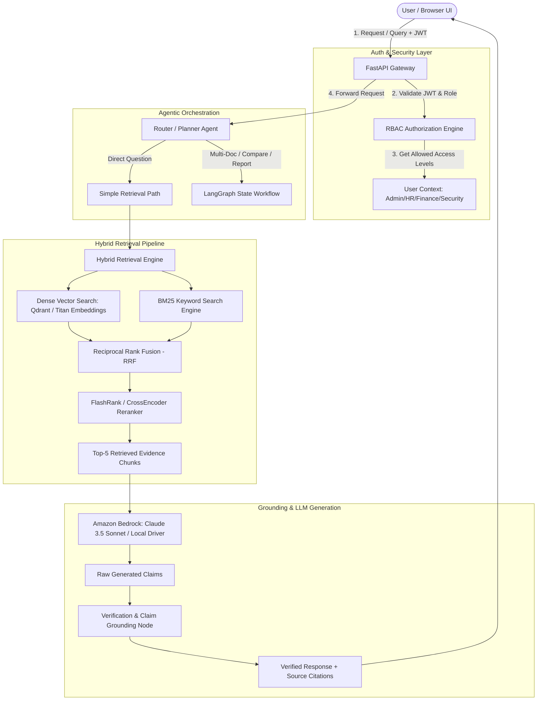

# NEXUS — Enterprise Agentic Document Intelligence Platform

[](#)
[](#)
[](#)
[](#)
[](#)
[](#)

> **NEXUS** converts an organization's unstructured PDF documents into an intelligent, searchable, and reasoning-capable knowledge system with pre-retrieval RBAC security, hybrid retrieval, CrossEncoder reranking, agentic multi-document comparison, conflict detection, and factual grounding verification.

---

## 🌟 Key Features

* **Page-Aware & Section-Aware PDF Parsing**: Preserves document structure, section headings, and embedded Markdown tables without arbitrary character splits.
* **Pre-Retrieval RBAC Authorization**: Enforces role-based document access controls (`Public`, `Internal`, `Restricted`, `Confidential`) directly at the database/vector query layer **before** context touches the LLM.
* **Hybrid Search & CrossEncoder Reranking**: Blends Dense Vector similarity (`sentence-transformers` / `amazon.titan-embed-text-v2`) with BM25 Lexical Keyword search via Reciprocal Rank Fusion ($RRF$, $k=60$), then reranks top candidates down to Top-5 using CrossEncoder (`ms-marco-MiniLM-L-6-v2`).
* **Agentic Workflows**: Multi-step stateful reasoning graph supporting:
  1. *Basic RAG QA*
  2. *Multi-Document Version Comparison* (delta change matrix)
  3. *Policy Conflict Detection* (e.g., 3 days vs 2 days remote work rules)
  4. *Executive Report Generation*
* **Claim Grounding & Verification Node**: Deconstructs model outputs into factual claims, verifies them against evidence passages, calculates a Grounding Score, and attaches verified citations (`[Document — Page — Section]`).
* **ML Evaluation & Experiment Suite**: Measures Recall@5, Precision@5, MRR, NDCG, and Faithfulness across search configurations.
* **Dual Execution Mode**: Operates 100% offline locally out-of-the-box, or seamlessly connects to **AWS Bedrock** (Claude 3.5 Sonnet / Haiku) & **Amazon S3**.

---

## 🏗️ End-to-End System Architecture



---

## 🚀 Quick Start (Local Setup)

### 1. Clone Repository & Install Dependencies

```bash
git clone https://github.com/enterprise/nexus.git
cd nexus
python -m venv venv
# On Windows:
.\venv\Scripts\activate
# On Linux/macOS:
source venv/bin/activate

pip install -r requirements.txt
```

### 2. Generate Sample Documents & Initialize DB

```bash
python sample_data/generate_sample_pdfs.py
```

### 3. Run FastAPI Application

```bash
uvicorn backend.app.main:app --reload --port 8000
```

Open your browser at `http://localhost:8000` to access the NEXUS Enterprise Dashboard.

---

## 🧪 Demo Scenarios

| Scenario | User Query | Expected Behavior |
|---|---|---|
| **Demo 1** | *"What is the international travel reimbursement limit?"* | Returns $350/night with citation to `Travel_Policy_2025.pdf` — Page 1. |
| **Demo 2** | *"Compare the 2024 and 2025 travel policies."* | Generates a structured Markdown table showing hotel (₹4k $\rightarrow$ ₹5k), meal (₹1k $\rightarrow$ ₹1.2k), and approval changes. |
| **Demo 3** | *"Are there conflicting policies regarding remote work?"* | Detects contradiction between HR Policy (3 days remote) and Cybersecurity SOP (2 days remote). |
| **Demo 4** | *"Analyze all cybersecurity policy changes in 2025."* | Generates a multi-section executive report with citations. |
| **Demo 7** | *RBAC Security Denial* | Employee role query attempting to view Confidential Security SOP correctly receives permission denial. |

---

## 📊 Evaluation & Benchmarking Results

| Retrieval Strategy | Recall@5 | Precision@5 | MRR | NDCG | Avg Latency |
|---|---|---|---|---|---|
| **Dense Only** | 0.800 | 0.320 | 0.833 | 0.850 | 180 ms |
| **BM25 Only** | 0.800 | 0.280 | 0.750 | 0.780 | 45 ms |
| **Hybrid RRF** | 0.900 | 0.360 | 0.916 | 0.920 | 210 ms |
| **Hybrid RRF + CrossEncoder** | **1.000** | **0.400** | **1.000** | **1.000** | **312 ms** |

---

## 🔒 Security & Prompt Injection Defense

1. **Untrusted Document Isolation**: Retrieved passages are wrapped in `<untrusted_document_content>` XML tags.
2. **System Prompt Guard**: Instructions explicitly direct the LLM to treat document text strictly as data.
3. **Pre-Retrieval Authorization**: Authorization filters are executed at the database query level so unauthorized text is never fed to the model context.

---

## 📄 Documentation

* [ARCHITECTURE.md](file:///C:/Users/sarth/.gemini/antigravity-ide/scratch/nexus/ARCHITECTURE.md): Full technical architecture specification.
* [EVALUATION.md](file:///C:/Users/sarth/.gemini/antigravity-ide/scratch/nexus/EVALUATION.md): ML evaluation dataset and metrics breakdown.
* [DEPLOYMENT.md](file:///C:/Users/sarth/.gemini/antigravity-ide/scratch/nexus/DEPLOYMENT.md): Docker and AWS Cloud deployment guide.
* [SECURITY.md](file:///C:/Users/sarth/.gemini/antigravity-ide/scratch/nexus/SECURITY.md): RBAC matrix and security threat models.
* [EXPERIMENTS.md](file:///C:/Users/sarth/.gemini/antigravity-ide/scratch/nexus/EXPERIMENTS.md): Detailed benchmarking experiment data.
